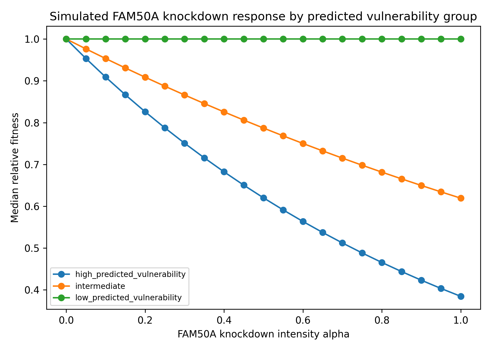
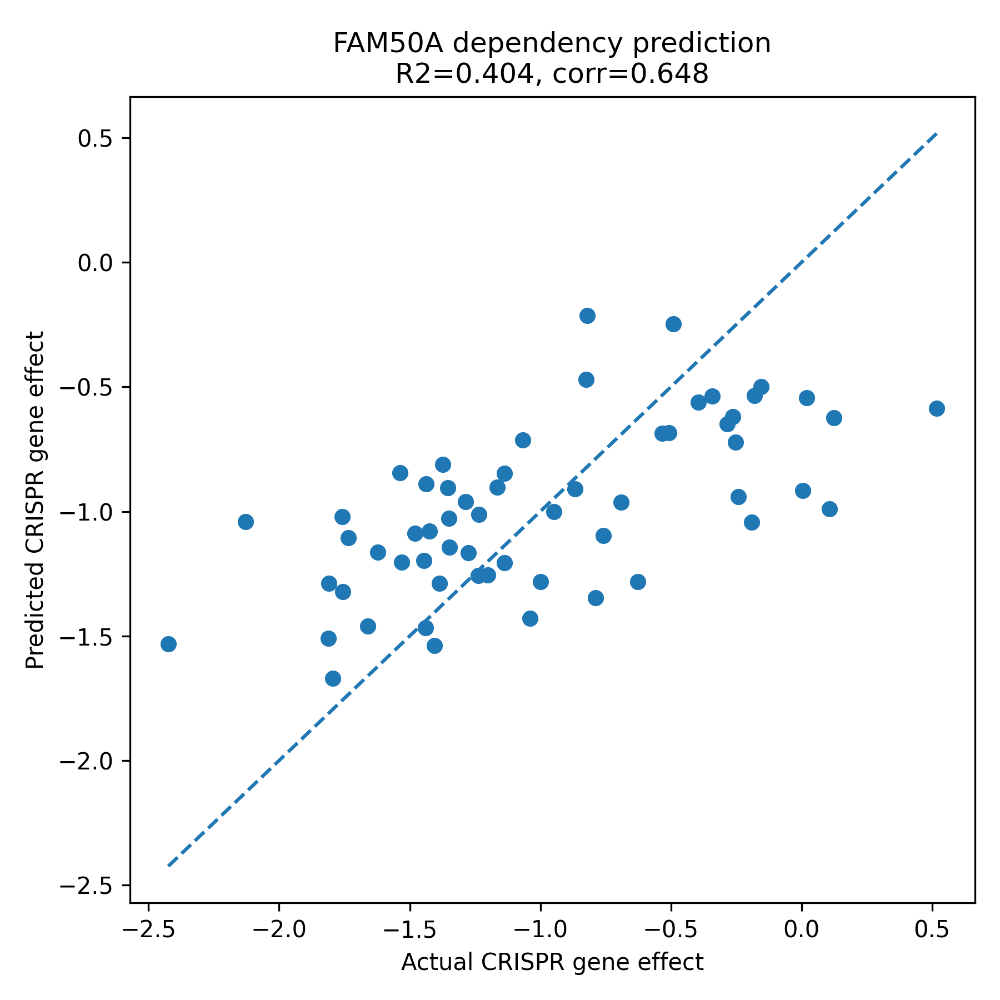
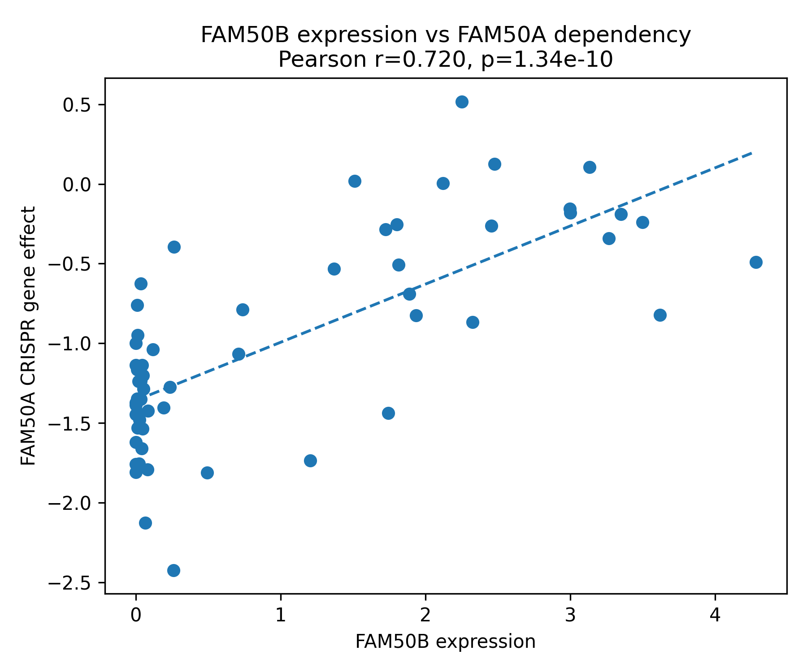
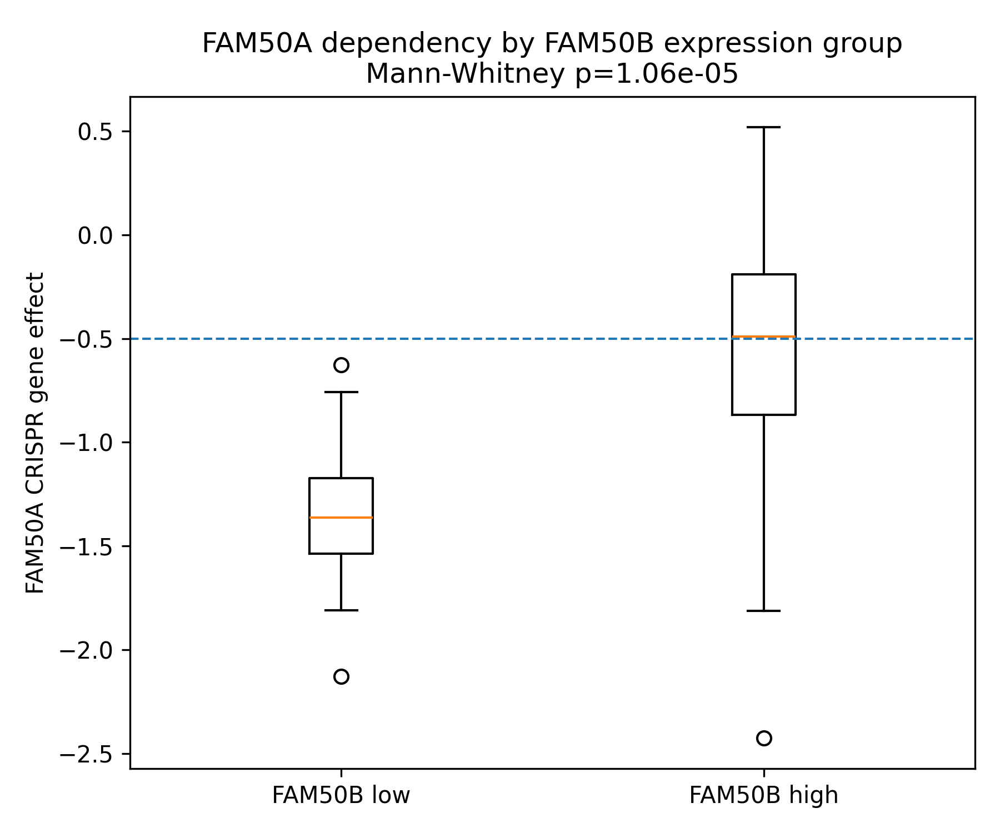
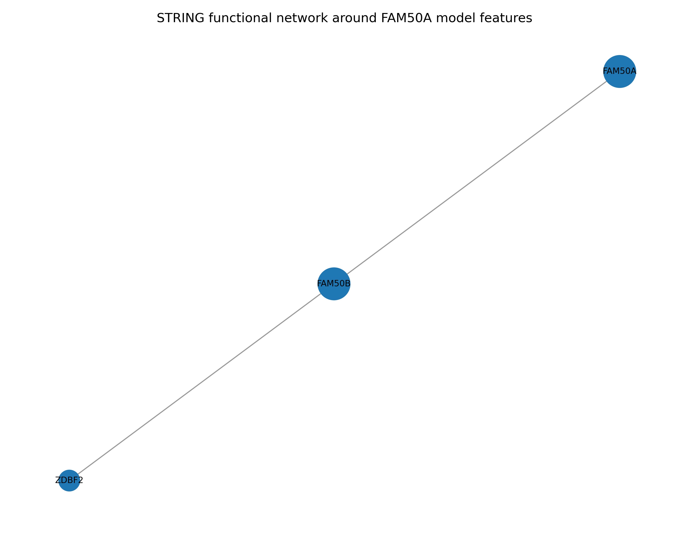
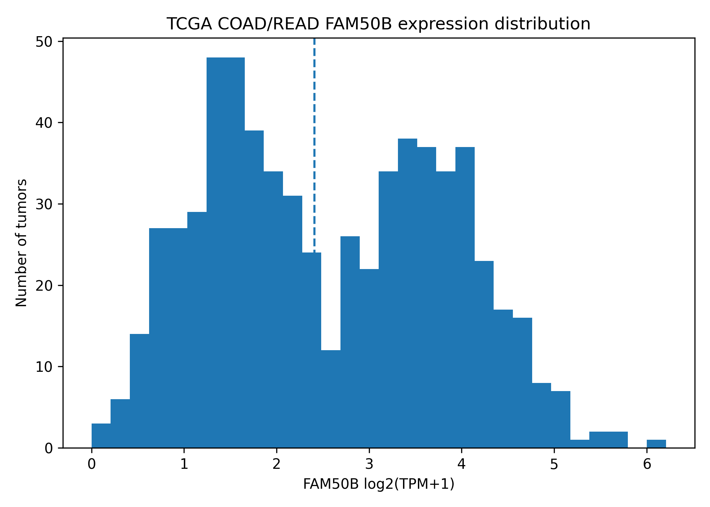
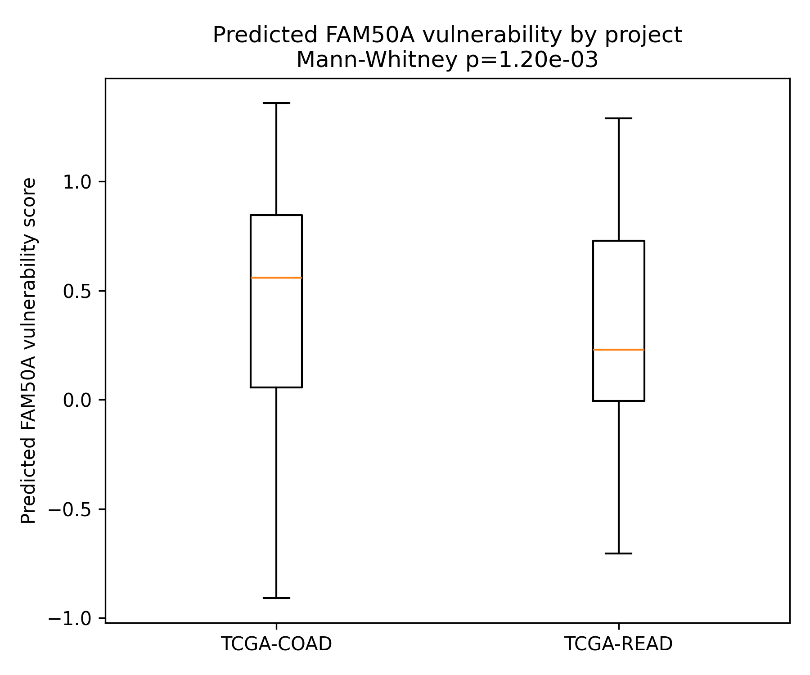
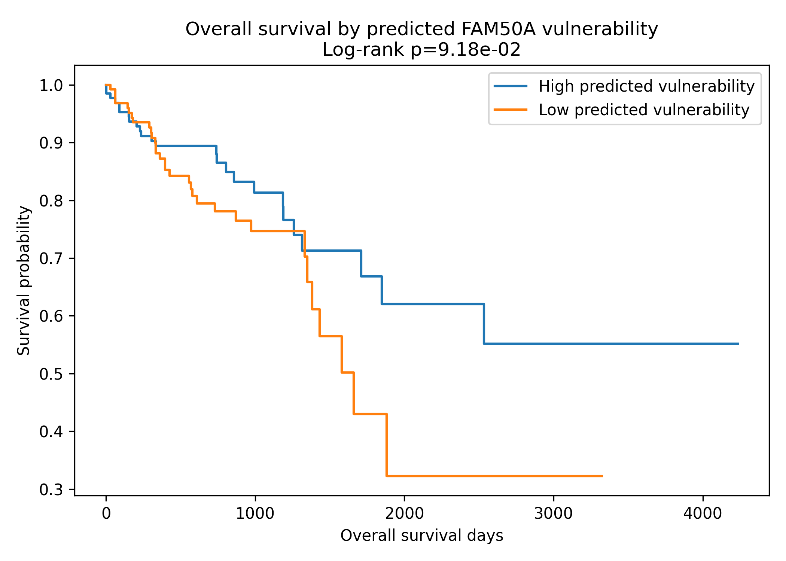
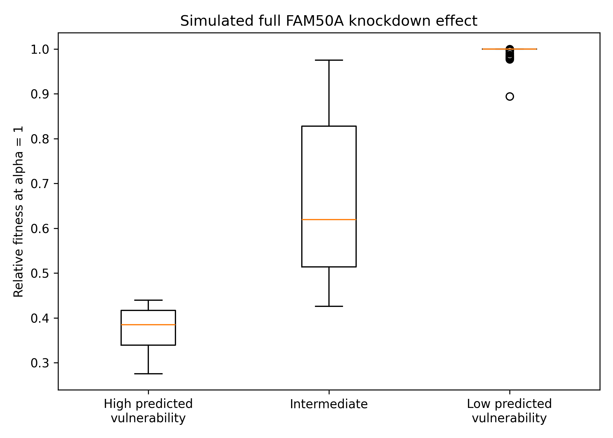

# CRC Dependency Analysis: FAM50A and FAM50B

> DepMap-based colorectal cancer gene dependency prediction, TCGA patient projection, and CRISPR knockdown network simulation.

This repository contains a computational biology pipeline for identifying context-specific cancer cell vulnerabilities. The current analysis focuses on the relationship between **FAM50A dependency** and **FAM50B expression** in colorectal cancer.

The main finding is that **FAM50B-low colorectal cancer cell lines show stronger FAM50A dependency in DepMap**, and this relationship can be projected onto TCGA COAD/READ patient tumors as a predicted vulnerability axis.

---

## Highlights

- Built a DepMap colorectal cancer cohort with **59 cell lines**.
- Integrated CRISPR gene effect, expression, copy number variation, and mutation features.
- Tested known colorectal cancer genes, then switched to data-driven target selection.
- Identified **FAM50A** as the strongest pilot dependency target.
- Found **FAM50B expression** as the key explanatory feature for FAM50A dependency.
- Projected the DepMap-derived FAM50A vulnerability axis onto **647 TCGA COAD/READ primary tumors**.
- Explored clinical association using stage, survival, and Cox regression.
- Implemented a simple **FAM50A CRISPR knockdown network simulation MVP**.

---

## Graphical summary



The final simulation suggests that tumors with high predicted FAM50A vulnerability would show the largest relative fitness decrease under simulated FAM50A knockdown.

---

## Project workflow

```text
DepMap data
  -> colorectal cancer cell line filtering
  -> multi-omics feature matrix construction
  -> CRISPR dependency target selection
  -> FAM50A dependency modeling
  -> FAM50B feature interpretation
  -> STRING / Reactome analysis
  -> TCGA COAD/READ patient projection
  -> clinical association analysis
  -> CRISPR knockdown network simulation
```

---

## Data sources

The analysis uses public functional genomics and cancer genomics resources.

| Source | Role in this project |
|---|---|
| DepMap | CRISPR gene effect labels and cell line multi-omics features |
| GDC / TCGA | COAD/READ patient RNA-seq expression and clinical metadata |
| STRING | Functional network around FAM50A model features |
| Reactome | Exploratory pathway enrichment analysis |

Raw DepMap and GDC files are not included in this repository because of file size and data-use considerations. This repository stores scripts, manifests, summary tables, and generated figures.

---

## Main results

### 1. FAM50A dependency is predictable in DepMap colorectal cancer cell lines

A multi-omics Elastic Net model predicted FAM50A CRISPR gene effect with moderate performance.

| Metric | Value |
|---|---:|
| R2 | 0.404 |
| Correlation | 0.648 |
| RMSE | 0.488 |
| Permutation empirical p-value | 0.0196 |



---

### 2. FAM50B expression explains FAM50A dependency

FAM50B expression was the most stable feature selected across cross-validation folds. A model using only FAM50B expression performed as well as, or slightly better than, the full multi-omics model.

| Model | R2 |
|---|---:|
| FAM50B expression only | 0.434 |
| Full multi-omics model | 0.404 |
| Full model without FAM50B expression | 0.103 |



---

### 3. FAM50B-low cell lines show stronger FAM50A dependency

FAM50B-low colorectal cancer cell lines showed more negative FAM50A gene effect values, indicating stronger dependency.

| Group | Median FAM50A gene effect |
|---|---:|
| FAM50B-low | -1.36 |
| FAM50B-high | -0.49 |

Mann-Whitney p-value: **1.06e-05**



---

### 4. STRING network supports a functional FAM50A-FAM50B connection

STRING functional network analysis returned a compact network connecting FAM50A, FAM50B, and ZDBF2.

```text
FAM50A -- FAM50B -- ZDBF2
```



Reactome over-representation analysis did not identify significant pathways at FDR < 0.05. Therefore, Reactome results are treated as exploratory only.

---

### 5. TCGA COAD/READ tumors can be stratified by FAM50B expression

FAM50A and FAM50B expression values were extracted from TCGA COAD/READ primary tumor RNA-seq files.

| Cohort | Number of primary tumors |
|---|---:|
| TCGA-COAD | 481 |
| TCGA-READ | 166 |
| Total | 647 |

FAM50B expression was used to define FAM50B-low and FAM50B-high tumor groups.



---

### 6. DepMap-derived FAM50A vulnerability can be projected onto TCGA tumors

A simple DepMap-derived linear model was trained using FAM50B expression to predict FAM50A gene effect.

| Parameter | Value |
|---|---:|
| Intercept | -1.3587 |
| Slope | 0.3651 |
| DepMap R2 | 0.5179 |
| RMSE | 0.4385 |

TCGA predicted vulnerability groups:

| Group | Number of tumors |
|---|---:|
| High predicted vulnerability | 162 |
| Intermediate | 323 |
| Low predicted vulnerability | 162 |

Predicted vulnerability was higher in TCGA-COAD than in TCGA-READ.



---

### 7. Predicted FAM50A vulnerability was not an independent survival marker

Predicted vulnerability scores were merged with TCGA clinical metadata.

| Analysis | Result |
|---|---:|
| Merged clinical cases | 624 |
| Stage-known cases | 506 |
| Survival-usable cases | 530 |
| Stage-vulnerability chi-square p-value | 0.2733 |
| High vs low log-rank p-value | 0.09184 |
| Final adjusted Cox HR | 0.961 |
| Final adjusted Cox p-value | 0.721 |

These results do not support predicted FAM50A vulnerability as an independent overall survival prognostic marker in the current TCGA analysis.



---

### 8. Knockdown simulation shows stronger fitness loss in the high-vulnerability group

A simple network simulation was implemented using the STRING-derived FAM50A-FAM50B-ZDBF2 network and TCGA predicted vulnerability scores.

At full simulated knockdown intensity alpha = 1:

| Group | Median relative fitness |
|---|---:|
| High predicted vulnerability | 0.385 |
| Intermediate | 0.619 |
| Low predicted vulnerability | 1.000 |




This simulation is a conceptual MVP model. It does not replace wet-lab CRISPR knockdown experiments or mechanistic biochemical modeling.

---

## Interpretation

The current pipeline supports the following interpretation:

> FAM50B-low colorectal cancer cell lines show stronger FAM50A dependency in DepMap. This relationship can be projected onto TCGA COAD/READ tumors to define a predicted FAM50A vulnerability axis. The axis is not an independent survival marker in the current TCGA clinical analysis, but it can be used to define a molecularly stratified group that may be more sensitive to FAM50A perturbation in a simulation setting.

---

## Repository structure

```text
crc-dependency-fam50a/
├─ src/                  # analysis scripts
├─ artifacts/
│  ├─ figures/           # generated plots
│  ├─ tables/            # result tables and summaries
│  └─ manifests/         # file manifests and metadata tables
├─ data/                 # local data, excluded from GitHub
├─ README.md
└─ requirements.txt
```

---

## How to reproduce

### 1. Create environment

```bash
conda create -n crcdep python=3.11 -y
conda activate crcdep
pip install -r requirements.txt
```

### 2. Prepare data

Raw DepMap and GDC files must be downloaded separately and placed under local `data/raw/` folders.

The main expected local data folders are:

```text
data/raw/depmap/
data/raw/gdc/expression/
```

### 3. Run the main analysis scripts

The repository is organized as a sequential analysis pipeline. Representative scripts include:

```bash
python src/check_depmap_files.py
python src/build_depmap_crc_cohort.py
python src/subset_depmap_crc_matrices.py
python src/build_crc_mutation_matrix.py
python src/train_candidate_targets_elastic_net.py
python src/diagnose_best_target.py
python src/validate_fam50b_feature_importance.py
python src/build_fam50a_string_network.py
python src/run_fam50a_reactome_enrichment.py
python src/query_gdc_crc_expression.py
python src/extract_tcga_fam50_expression.py
python src/predict_tcga_fam50a_vulnerability.py
python src/query_gdc_crc_clinical.py
python src/analyze_tcga_vulnerability_clinical.py
python src/cox_tcga_fam50a_vulnerability.py
python src/simulate_fam50a_knockdown_network.py
```

---

## Limitations

- The DepMap colorectal cancer cohort contains only 59 cell lines.
- TCGA tumors do not have direct CRISPR dependency measurements.
- The TCGA vulnerability score is inferred from a DepMap-derived expression model.
- Clinical association results are exploratory and affected by missing metadata.
- Reactome pathway enrichment did not identify significant pathways at FDR < 0.05.
- The knockdown simulation is a toy MVP model, not a validated mechanistic model.
- Experimental validation is required to confirm FAM50A as a therapeutic vulnerability in FAM50B-low colorectal cancer.

---

## Next steps

- Refine the knockdown simulation using a larger biological network.
- Add bootstrapping or confidence intervals to the TCGA vulnerability projection.
- Compare FAM50A/FAM50B patterns across additional cancer types.
- Test independent CRISPR or cell line datasets if available.
- Organize scripts into modular folders for preprocessing, modeling, TCGA analysis, and simulation.
- Convert the current pipeline into a concise research report and presentation.
